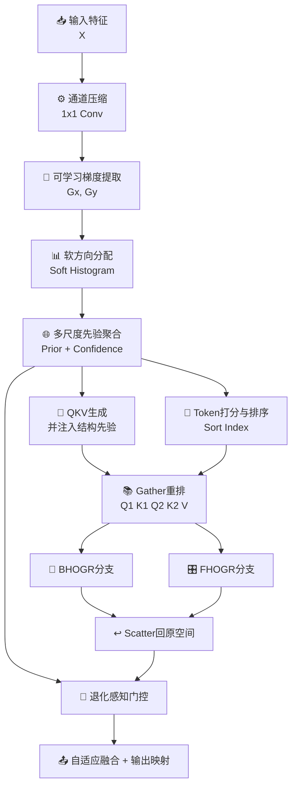

# ADHOGSA模块总结

## 1. 动机

### 现有HOG引导注意力方式的问题
在图像复原、低层视觉增强以及需要显式结构先验的视觉 Transformer 模块中，HOG 引导注意力是一条很有解释性的路线。它能够利用梯度幅值和方向信息，把具有相似结构退化模式的远距离位置重新组织到更适合建模的顺序中，再完成注意力聚合。

但如果直接沿用传统 `DHOGSA` 这一类基于手工 HOG 先验的设计，通常仍然会遇到以下问题：

- **固定 Sobel 滤波器表达能力有限**：虽然 Sobel 能够提供稳定的边缘方向响应，但它本质上是固定先验，无法根据任务数据中的真实退化模式自适应调整感受方向和响应强度。
- **硬离散分桶不可微且量化误差明显**：将方向角强行映射到某一个离散 bin，虽然实现简单，但边界附近的方向信息容易被粗糙量化，且不利于端到端优化。
- **单尺度 patch 统计难以覆盖异构退化**：局部雨纹、模糊边缘、雾化区域以及重复纹理伪影，往往具有不同空间尺度。若只在单一 patch 尺度上构建结构先验，容易顾此失彼。
- **双分支直接相乘融合过于刚性**：两个注意力分支虽然具有互补性，但若最终只通过逐元素相乘完成输出融合，就可能在某些区域把本来有价值的响应一起抑制掉。
- **显式先验与内容自适应之间仍有鸿沟**：纯手工 HOG 先验虽然可解释，但当它被直接塞入注意力流程时，往往缺少“根据输入内容调整先验强度”的自适应机制。

### 提出模块的目的
ADHOGSA（Adaptive Differentiable HOG-guided Self-Attention）的目标，是在保留 HOG 引导注意力“**显式结构先验 + 双分支重排注意力**”这一核心思想的基础上，把原本偏手工的 HOG 机制升级成更适合现代神经网络训练的**可学习、可微分、多尺度、自适应**版本。

模块的核心出发点是：

- 保留 HOG 先验对结构和退化模式的显式建模能力；
- 将固定梯度算子升级为**可学习梯度提取器**；
- 将硬方向分桶升级为**软方向分配机制**；
- 将单尺度结构先验升级为**多尺度结构先验融合**；
- 将刚性的双分支乘法融合升级为**退化感知门控融合**。

这样可以让 HOG 引导注意力从“手工先验驱动的可解释排序”进一步升级为“**可学习结构先验驱动的自适应注意力建模**”。

---

## 2. 模块工作原理和核心思想

### 核心思想
ADHOGSA可以概括为五个关键词：**提取、分配、聚合、重排、融合**。

- **提取（Adaptive Gradient Extraction）**：先使用可学习深度梯度卷积代替固定 Sobel，获得更适合当前任务的数据驱动结构响应。
- **分配（Soft Orientation Assignment）**：不再将方向角硬分配给单一 bin，而是通过软分配让一个像素同时对多个方向 bin 产生连续贡献。
- **聚合（Multi-Scale Structural Prior Aggregation）**：在多个 patch 尺度上统计软 HOG 结构描述，构建更加鲁棒的结构先验图和置信度图。
- **重排（Confidence-Aware Token Reordering）**：根据结构响应强度与方向一致性生成 token 排序依据，使注意力更聚焦于结构信息丰富的位置。
- **融合（Adaptive Dual-Branch Fusion）**：保留双分支 reshape-attention，但不再简单相乘，而是根据结构先验和分支输出自适应决定每个位置更应该相信哪一路。

### 整体流程



对应的核心流程可以写成：

```text
X -> Learnable Gradient -> Soft Orientation Histogram
  -> Multi-Scale Prior / Confidence
  -> Prior-aware QKV
  -> Token Ranking and Reordering
  -> Dual Reshape Attention (BHOGR + FHOGR)
  -> Adaptive Gated Fusion
  -> Output Projection
```

其中：

- `Prior` 是由多尺度软 HOG 描述子投影得到的结构先验图；
- `Confidence` 描述当前区域方向分布的一致性与可信度；
- `BHOGR` 分支偏向结构块级重排；
- `FHOGR` 分支偏向频率式顺序重排；
- `Gate` 决定两个分支在每个位置、每个通道上的融合比例。

### 2.1 可学习梯度提取
与传统 HOG 直接使用固定 Sobel 不同，ADHOGSA首先使用一个**按通道分组的可学习梯度提取器**：

```text
Gx, Gy = Grad_theta(X)
```

其卷积核以 Sobel 形式初始化，但在训练过程中可以自动调整。这样做的意义在于：

- 保留 Sobel 先验带来的稳定方向初始化；
- 允许模型学习更适合当前任务的结构检测方向；
- 让梯度响应不再局限于人工定义的边缘模板。

因此，ADHOGSA不是简单丢掉 HOG 思路，而是把“固定边缘先验”升级成“可学习结构响应先验”。

### 2.2 软方向直方图与结构置信度
得到梯度后，模块会计算幅值 `M` 和方向 `O`：

```text
M = sqrt(Gx^2 + Gy^2)
O = atan2(Gy, Gx)
```

传统 HOG 常用 `long()` 或硬量化方式把方向角映射到某一个 bin。ADHOGSA则采用**圆周意义上的软分配**：

```text
A = SoftAssign(O, centers, bandwidth)
```

也就是说，一个像素的方向响应不再只属于单个方向 bin，而是按照与多个 bin center 的角距离连续分配权重。这样可以：

- 减少 bin 边界带来的量化误差；
- 让结构描述子在方向变化较平滑的区域更稳定；
- 使方向建模部分能够在训练中端到端优化。

随后，模块还会根据方向直方图的熵来估计结构置信度：

```text
Confidence = 1 - Entropy(Histogram)
```

其直观含义是：

- 方向分布越集中，说明结构越清晰，置信度越高；
- 方向分布越分散，说明当前区域更模糊或更混杂，置信度越低。

### 2.3 多尺度结构先验聚合
为了避免单尺度 patch 统计对复杂退化建模不足，ADHOGSA在多个 patch 尺度上对软 HOG 描述子进行汇聚：

```text
Hs = Pool_s(SoftHOG)
Ps = Proj(Hs)
Cs = Conf(Hs)
```

再通过可学习尺度权重进行加权融合：

```text
Prior = Σ ws * Ps
Confidence = Σ ws * Cs
```

这样设计的作用是：

- 小尺度先验更敏感于局部纹理、雨纹、细边缘和小区域伪影；
- 大尺度先验更适合描述模糊、雾化、低频污染和全局结构失真；
- 多尺度融合后，结构先验对不同类型退化具有更强的普适性。

因此，ADHOGSA并不是只“做 HOG”，而是在做一种**多尺度可微结构先验建模**。

### 2.4 结构感知的 token 重排与双分支注意力
得到结构先验后，模块一方面将其注入 QKV 生成：

```text
QKV = DWConv(Conv1x1(X)) + α * PriorProj(Prior)
```

另一方面根据结构响应强度、方向一致性和方向期望共同生成 token 排序分数：

```text
Score = Magnitude * (1 + Confidence + OrientationExpectation)
```

再据此对 `Q1, K1, Q2, K2, V` 做统一重排：

```text
idx = Sort(Score)
Q', K', V' = Gather(Q, K, V, idx)
```

这样做的意义是：

- 让结构相近、退化相近的位置在排序后更容易被共同建模；
- 让注意力不是直接在原始空间顺序上做，而是在“结构相关顺序”上做；
- 显式强化结构丰富位置在全局建模中的优先级。

随后模块保留两个互补分支：

- **BHOGR 分支**：更偏向块状或分箱式重排，更适合建模大尺度结构相关性；
- **FHOGR 分支**：更偏向频率式线性重排，更适合建模细粒度顺序依赖。

这使 ADHOGSA 仍然继承了 `DHOGSA` 中“两个不同重排视角互补建模”的核心优势。

### 2.5 退化感知门控融合
在原始 `DHOGSA` 中，两条分支最终常通过逐元素相乘进行融合。这种方式虽然简单，但也可能带来一个问题：如果某一位置在两路中有一路较弱，就会把整体输出一起压低。

ADHOGSA将这一步替换为**退化感知门控融合**：

```text
Gate = Sigmoid(Conv([Yb, Yf, Prior, Confidence]))
Out = Gate * Yb + (1 - Gate) * Yf + β * PriorResidual
```

其本质是：

- 让模型自己决定当前区域更依赖块级结构分支还是频率式分支；
- 避免分支相乘导致有用响应一起塌缩；
- 额外保留一条来自结构先验的残差补偿路径，增强最终输出的稳定性。

最后再通过 `1×1 Conv` 输出映射，得到与输入同形状的结果特征图。

---

## 3. 解决了什么问题

### 3.1 解决固定手工梯度先验表达能力不足的问题
传统 HOG 引导注意力依赖固定 Sobel 或类似手工梯度模板，这种方式虽然具有可解释性，但对具体任务和具体退化模式的适应能力有限。

ADHOGSA通过可学习梯度提取器，让结构响应能够随着训练自动调整，从而使先验不再停留在“只能检测通用边缘”，而是能够逐渐贴近任务真正需要的结构模式。

### 3.2 解决硬方向分桶带来的不可微和量化误差问题
把方向角强制分到某一个 bin 中，本质上是一种离散决策。对于 bin 边界附近的像素，微小方向变化就可能导致响应跳变，这会影响稳定性，也不利于端到端优化。

ADHOGSA通过软方向分配，使每个像素同时对多个 bin 产生连续贡献，从而减少量化误差，并让 HOG 先验路径更平滑、更易训练。

### 3.3 解决单尺度结构先验难以覆盖复杂退化的问题
实际视觉任务中的退化往往具有明显尺度差异。例如：

- 雨丝、细纹理、边界断裂更偏小尺度；
- 雾化、模糊、光照污染和大结构畸变更偏大尺度。

如果只在单一 patch 尺度上统计 HOG 信息，容易只能关注其中一部分模式。ADHOGSA通过多尺度结构先验聚合，使模块既能看见局部纹理，也能看见更大范围的结构失真。

### 3.4 解决双分支简单相乘融合过于刚性的问题
双分支注意力本来是为了互补建模，但如果最终只通过逐元素相乘融合，一旦某一支在某些区域响应偏低，就容易把另一支本来有效的信息一起削弱。

ADHOGSA通过门控融合机制，让两个分支的作用关系从“必须同时强才强”变成“根据内容动态分配谁主导”，从而更适合处理不同类型、不同强度的退化区域。

### 3.5 解决可解释性与自适应性难以兼顾的问题
很多纯注意力模块强调表达能力，但缺少显式结构先验；很多手工先验模块则强调解释性，但自适应能力不足。

ADHOGSA试图在二者之间建立平衡：

- 用软 HOG 和多尺度先验保留结构解释性；
- 用可学习梯度提取、先验注入和门控融合增强数据驱动自适应性；
- 在不改变输入输出接口的前提下，保持较好的可插拔性。

因此，它更像是一种“**可学习结构先验增强的双分支自注意力模块**”，而不是单纯把 HOG 特征拼接进注意力。

---

## 4. 总结

ADHOGSA本质上是一种面向**结构先验增强视觉 Transformer**的自适应 HOG 引导注意力模块。它延续了 `DHOGSA` 中“利用 HOG 类结构特征对 token 进行重排并做双分支注意力建模”的思想，但不再满足于固定梯度、硬分桶和刚性分支融合，而是进一步引入：

- **可学习梯度提取**，提升结构响应的任务适配能力；
- **软方向直方图分配**，让 HOG 描述子更加平滑、可微；
- **多尺度结构先验聚合**，增强对异构退化模式的覆盖能力；
- **结构感知 token 重排**，让全局建模更聚焦于结构显著区域；
- **退化感知门控融合**，提升双分支协同的灵活性与稳定性。

从结构角度看，ADHOGSA将 HOG 引导注意力从“**固定手工结构排序**”升级为“**可学习、多尺度、可微分的结构先验驱动注意力**”。因此，它特别适合那些既希望保留显式结构解释性，又希望获得更强内容自适应建模能力的低层视觉与通用视觉 Transformer 场景。
