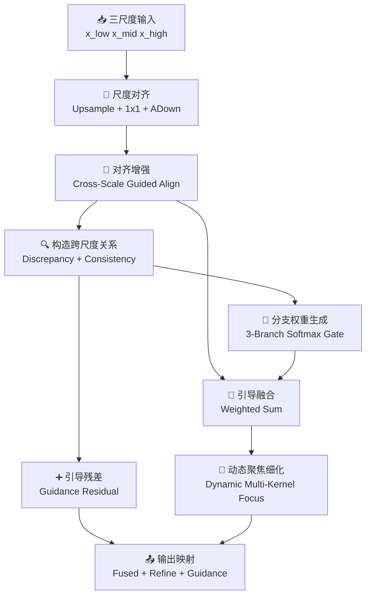

# AlignmentGuidedFocusFeature模块总结

## 1. 动机

### 现有多尺度聚焦模块在跨尺度对齐上的问题
多尺度特征融合模块通常默认不同尺度特征经过上采样或下采样后就可以直接融合，但实际情况并不总是如此。即使分辨率被统一，不同分支在目标位置、边界形态和响应强度上仍然可能存在偏移。对于原始 `FocusFeature` 而言，这会带来几个问题：

- **跨尺度对齐较为粗糙**：简单的 `Upsample` 或 `ADown` 只能统一尺寸，但无法显式校正不同尺度之间的内容错位。
- **融合过程缺少差异信息建模**：如果某一路分支与中尺度参考存在较大偏差，原始模块并不会单独刻画这种不一致性。
- **融合过程缺少一致性信息建模**：跨尺度之间真正稳定、互补的公共语义并没有被显式强化。
- **多分支权重分配缺少指导依据**：融合时更像是“将三路特征一起处理”，而不是先回答“谁更一致、谁更偏差、谁更值得信任”。

### 提出模块的目的
`AlignmentGuidedFocusFeature` 的目标，是在保留三尺度聚焦框架的同时，把跨尺度融合升级成“**先对齐、再分析差异与一致性、最后完成引导融合**”。

它希望同时做到：

- 在尺度归一化之后，进一步做内容感知的对齐增强；
- 显式构建差异项与一致项，使模型能看见跨尺度之间的偏差与共性；
- 用差异/一致性信息去指导三路分支权重分配和融合残差。

因此，这个模块的核心目标可以概括为：

- 保留中尺度为中心的聚焦范式；
- 引入显式对齐引导；
- 显式建模跨尺度差异与一致性；
- 让最终融合由引导信息驱动，而不是仅靠隐式卷积学习。

---

## 2. 模块工作原理和核心思想

### 核心思想
`AlignmentGuidedFocusFeature` 可以概括为四个关键词：**对齐增强、差异建模、一致性建模、引导聚焦**。

- **对齐增强（Alignment Enhancement）**：在尺度统一后，以中尺度特征为参考，对低尺度和高尺度分支进一步做内容感知对齐。
- **差异建模（Discrepancy Modeling）**：使用绝对差构造跨尺度偏差信息，显式描述不同尺度之间的不一致响应。
- **一致性建模（Consistency Modeling）**：使用逐元素乘法构造跨尺度公共响应，显式描述稳定共享语义。
- **引导聚焦（Guided Focusing）**：利用差异与一致性信息生成分支权重，并进一步形成融合残差指导最终输出。

### 整体流程



对应的主流程可以写成：

```text
[x_low', x_mid', x_high'] = GuidedAlignToMid(x_low, x_mid, x_high)

D = DiscrepancyProj(|x_low'-x_mid'|, |x_mid'-x_high'|, |x_low'-x_high'|)
C = ConsistencyProj(x_low'*x_mid', x_mid'*x_high', x_low'*x_high')

[w_l, w_m, w_h] = Softmax(BranchGate(x_low', x_mid', x_high', D, C))
F = w_l * x_low' + w_m * x_mid' + w_h * x_high'

R = GuidanceResidual(D, C)
Y = F + DynamicFocus(F) + gamma * R
Out = Conv1x1(Y)
```

其中：

- `GuidedAlignToMid` 表示带对齐增强的三尺度统一；
- `D` 表示差异特征；
- `C` 表示一致性特征；
- `BranchGate` 表示三路分支权重生成器；
- `R` 表示差异/一致性引导残差；
- `gamma` 对应实现中的 `guidance_scale`。

### 2.1 三尺度统一与中尺度参考对齐
模块首先和原始 `FocusFeature` 一样，把三路输入统一到中尺度上：

- 低尺度特征上采样到中尺度；
- 中尺度特征做通道映射；
- 高尺度特征通过 `ADown` 下采样到中尺度。

但与原始模块不同的是，这里不会直接把三路特征送去融合，而是引入一个以中尺度特征为参考的对齐增强步骤：

```text
x_low'' = Align(x_low', x_mid')
x_high'' = Align(x_high', x_mid')
```

这样做的意义在于：

- 先让低尺度和高尺度分支与中尺度参考建立更稳定的对应关系；
- 降低跨尺度融合中由错位带来的噪声；
- 为后续差异/一致性建模提供更可靠的输入。

### 2.2 差异项建模
在对齐增强之后，模块会显式构造三组跨尺度差异信息：

```text
|x_low - x_mid|, |x_mid - x_high|, |x_low - x_high|
```

并通过卷积映射得到统一的差异表示：

```text
D = DiscrepancyProj(Concat(...))
```

差异项的作用是：

- 显示哪些区域在不同尺度下响应不一致；
- 让模型知道哪些位置可能存在边界漂移、纹理冲突或局部错位；
- 为后续分支权重生成提供“不一致性证据”。

### 2.3 一致性项建模
除了差异项，模块还会构造三组跨尺度一致性信息：

```text
x_low * x_mid, x_mid * x_high, x_low * x_high
```

再经过卷积映射得到统一的一致性表示：

```text
C = ConsistencyProj(Concat(...))
```

一致性项的作用是：

- 强调不同尺度间稳定共享的语义响应；
- 表示哪些目标结构在多尺度上都被可靠感知；
- 为融合过程提供“可信公共信息”。

因此，模块不会只看“哪里不同”，也会看“哪里相同”。这使它比单纯的差异引导更稳健。

### 2.4 差异/一致性引导的分支权重分配
在得到三路对齐特征以及差异项、一致性项之后，模块会将它们共同输入到门控网络中，生成三路分支的 softmax 权重：

```text
[w_l, w_m, w_h] = Softmax(BranchGate(x_low, x_mid, x_high, D, C))
```

随后完成三路引导融合：

```text
F = w_l * x_low + w_m * x_mid + w_h * x_high
```

这样做的意义是：

- 三路权重不再只是由原始特征响应决定；
- 差异信息会抑制那些偏差较大的分支；
- 一致性信息会强化那些跨尺度稳定的分支；
- 最终融合具备更清晰的解释基础。

### 2.5 引导残差与动态细化
在主融合结果之外，模块还会将差异项和一致性项进一步拼接，通过一个轻量残差分支形成引导残差：

```text
R = GuidanceResidual(D, C)
```

同时，对已经融合得到的中尺度特征再做一次动态多核聚焦细化：

```text
F_refine = DynamicFocus(F)
```

最终输出为：

```text
Y = F + F_refine + gamma * R
Out = Conv1x1(Y)
```

这意味着：

- `F` 提供引导分配后的主融合结果；
- `F_refine` 提供动态感受野细化；
- `R` 提供差异/一致性信息形成的补偿项；
- 三者共同构成更稳健的中尺度聚焦表示。

---

## 3. 解决了什么问题

### 3.1 解决简单尺度统一不能真正解决内容错位的问题
传统多尺度融合往往默认“尺寸对齐后就可以直接融合”，但实际上不同尺度仍然可能存在位置偏差和响应漂移。

`AlignmentGuidedFocusFeature` 通过参考中尺度特征的对齐增强步骤，让跨尺度融合不再只是几何尺度一致，而更接近语义内容一致。

### 3.2 解决跨尺度融合缺少显式差异建模的问题
原始 `FocusFeature` 虽然能做多尺度聚焦，但并不会明确告诉模型“哪些区域在不同尺度下其实是不一致的”。

该模块通过绝对差构造差异项，让网络显式感知跨尺度不匹配区域，从而减少错误叠加。

### 3.3 解决跨尺度稳定语义缺少显式强化的问题
很多真正可靠的目标响应，是在不同尺度上都一致存在的。如果只看原始特征，很难单独突出这些稳定共性。

该模块通过逐元素乘法构造一致性项，使多尺度公共语义能够被单独建模和强化。

### 3.4 解决三路分支权重分配缺少依据的问题
在普通融合中，三路分支的主次关系往往由卷积隐式学习，缺少清晰的引导信号。

`AlignmentGuidedFocusFeature` 则把“差异信息”和“一致性信息”直接纳入权重生成过程，使分支选择更有依据，也更适合论文中的可解释性表达。

### 3.5 解决仅依赖主融合结果可能丢失引导信息的问题
即使分支权重已经由差异/一致性引导生成，某些偏差信息和公共信息仍然可能在主融合过程中被压缩。

为此，该模块额外保留引导残差分支，让差异/一致性信息不只影响权重分配，还能作为补偿信息直接参与最终输出构建。

---

## 4. 总结

`AlignmentGuidedFocusFeature` 本质上是一种把**跨尺度对齐增强**与**差异/一致性引导融合**结合起来的中尺度聚焦模块。它并不是简单在 `FocusFeature` 前面再加一个对齐层，而是通过：

- **中尺度参考下的三尺度对齐增强** 降低跨尺度错位；
- **差异项建模** 显式捕获分支偏差；
- **一致性项建模** 显式强化稳定共享语义；
- **引导式三路分支权重分配** 让融合决策更有依据；
- **引导残差与动态聚焦细化** 提升最终表达的稳健性与细粒度能力；

将原始 `FocusFeature` 从“静态多尺度空间聚焦”升级为“**对齐感知、关系引导的多尺度聚焦模块**”。

因此，`AlignmentGuidedFocusFeature` 特别适合那些关注小目标、边界对齐、密集目标以及跨尺度语义一致性的检测与分割场景。
