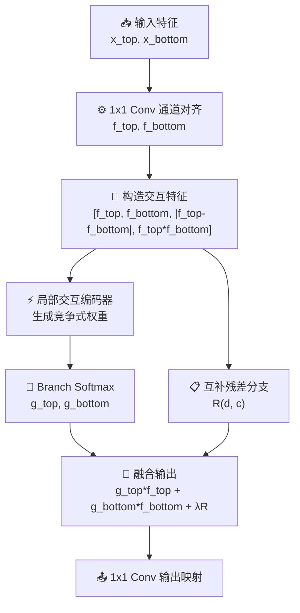

# CIDAF模块总结

## 1. 动机

### 现有同尺度双输入融合方式的问题
在目标检测的 neck 或 FPN/PAN 结构中，经常会遇到**两个空间尺度相同的特征图需要融合**的场景。这两路特征虽然具有相同的分辨率，但它们的来源往往不同，因此在语义重心、响应模式和有效信息类型上并不完全一致。

常见问题主要体现在以下几个方面：

- **直接相加（Add）过于静态**：默认两路输入在所有位置和所有通道上都具有近似等价的贡献，难以针对目标区域动态调整主次关系。
- **直接拼接（Concat）缺少显式决策机制**：虽然保留了更多信息，但只是把两路特征堆叠在一起，后续卷积需要自己学习“该相信谁、该抑制谁”，融合目标不够明确。
- **独立门控无法充分表达分支关系**：即使加入动态权重，很多方法仍然是分别给两路特征做缩放，而没有显式建模两路之间的差异、共识与竞争关系。
- **检测 neck 中的两路分支通常角色不同**：一条分支往往更偏语义和上下文信息，另一条分支更偏边界、纹理和定位细节。如果融合策略不能体现这种结构性差异，就容易导致有效信息被稀释。

### 提出模块的目的
CIDAF（Competitive Interactive Dynamic Align Fusion）的目标，是在**不改变输入空间尺寸**的前提下，为两个同尺度输入建立一种更具论文表达力的动态融合机制。它不是简单地对两路特征分别加权，而是先显式建模二者之间的**差异关系**和**一致关系**，再通过**竞争式分配机制**决定当前区域更应该信任哪一路，同时通过**互补残差分支**保留容易在竞争过程中被压制的细节信息。

模块的核心出发点是：

- 先对两路输入进行**通道对齐**；
- 再显式构造**差异特征**与**一致特征**；
- 基于联合关系生成两路分支的**竞争式权重**；
- 通过**互补残差保留**避免有价值的弱响应被完全抹掉；
- 最后输出更加适合检测 neck 使用的融合特征。

这样可以让融合过程从“静态混合”升级为“**先建模关系，再决策融合**”。

---

## 2. 模块工作原理和核心思想

### 核心思想
CIDAF可以概括为四个关键词：**对齐、交互、竞争、保留**。

- **对齐（Align）**：先把两路输入映射到统一通道空间，保证后续关系建模建立在一致的特征表征基础上。
- **交互（Interaction）**：不仅使用原始两路特征，还显式构造差异项和一致项，让模块真正感知两路分支之间“哪里不同、哪里一致”。
- **竞争（Competitive Allocation）**：利用 `softmax` 在分支维度上生成竞争式权重，而不是用两个互不约束的独立门控。
- **保留（Complementary Residual Preservation）**：在主分支竞争之外，再保留一条互补残差路径，防止细粒度但有价值的信息被抑制。

### 整体流程



对应的核心流程可以写成：

```text
f_top = Align_top(x_top)
f_bottom = Align_bottom(x_bottom)

d = |f_top - f_bottom|
c = f_top * f_bottom
z = Concat(f_top, f_bottom, d, c)

[g_top, g_bottom] = Softmax(InteractionEncoder(z))
r = ComplementaryResidual(d, c)

out = OutputProj(g_top * f_top + g_bottom * f_bottom + λ * r)
```

其中：

- `d` 表示 discrepancy feature，用于描述两路分支之间的差异与互补；
- `c` 表示 consistency feature，用于描述两路分支之间的共识与一致激活；
- `g_top`、`g_bottom` 是按分支竞争得到的权重；
- `r` 是互补残差；
- `λ` 是可学习残差缩放系数，对应代码中的 `residual_scale`。

### 2.1 通道对齐
CIDAF首先使用两个独立的 `1×1 Conv`：

```text
f_top = Conv1x1(x_top)
f_bottom = Conv1x1(x_bottom)
```

其作用不是简单压缩，而是将两路输入统一映射到相同的输出通道维度 `ouc`。这样做有两个直接好处：

- 解决两路输入通道数可能不同的问题；
- 保证差异建模、一致建模和竞争分配都在统一特征空间中进行。

因此，CIDAF要求**空间尺寸一致**，但对输入通道数并不敏感。

### 2.2 差异特征与一致特征建模
与原始 DAF 只对拼接特征做联合卷积不同，CIDAF显式构造了两种关系描述子：

```text
d = |f_top - f_bottom|
c = f_top ⊙ f_bottom
```

其中：

- **差异特征 `d`** 更适合表达两路分支在局部区域中的不一致性，例如边界、遮挡、小目标细节、定位偏差等；
- **一致特征 `c`** 更适合表达两路分支同时认可的稳定响应区域，例如目标主体、显著前景、共享语义区域等。

这样的设计使模块不再只看到“两个输入”，而是进一步看到“这两个输入之间的关系”。对于检测 neck 来说，这一点尤为重要，因为很多有效的定位信息本身就体现在分支差异之中，而很多可靠的语义信息则体现在分支共识之中。

### 2.3 竞争式权重生成机制
在得到 `f_top`、`f_bottom`、`d` 和 `c` 后，CIDAF将它们在通道维拼接：

```text
z = Concat(f_top, f_bottom, d, c)
```

随后送入一个轻量局部交互编码器：

- 先使用**深度卷积**提取局部邻域交互；
- 再通过**逐点卷积**完成通道混合；
- 最后输出 `2 × ouc` 个通道，对应两条分支的权重 logits。

接着将输出重排为分支维度上的两组响应，并执行：

```text
[g_top, g_bottom] = Softmax(logits, dim=branch)
```

与两个独立 `sigmoid` 不同，这里的 `softmax` 使两路分支在同一位置、同一通道上形成**显式竞争关系**。也就是说：

- 当某个区域更适合保留语义强的一路时，该路权重会更大；
- 当某个区域更依赖细节强的一路时，另一条分支会占主导；
- 两路分支的贡献不再彼此独立，而是通过竞争式分配共同决定最终输出。

这使得CIDAF比“独立门控融合”更符合检测 neck 中两路分支的实际协同方式。

### 2.4 互补残差保留机制
仅靠竞争式分配虽然可以突出主导分支，但也存在一个风险：一些较弱但仍有价值的响应可能会被压制得过于严重。为了避免这种情况，CIDAF额外引入了互补残差分支：

```text
r = Project(DepthwiseConv(d) + Conv1x1(c))
```

它的作用包括：

- 从差异特征中恢复局部结构与边界细节；
- 从一致特征中提炼稳定共识响应；
- 在主分支竞争之外，为最终输出补充一条互补信息路径。

最终融合形式为：

```text
y = g_top * f_top + g_bottom * f_bottom + λ * r
```

其中 `λ` 为可学习参数。这样设计后，CIDAF既能让主导分支更突出，又不会完全丢失另一条分支中潜在有价值的弱信息。

### 2.5 输出映射
完成竞争融合与残差补偿后，CIDAF最后再通过一个 `1×1 Conv` 对输出进行线性映射：

```text
out = Conv1x1(y)
```

该步骤的作用包括：

- 对融合后的特征进行进一步整合；
- 提升输出特征与后续 neck 模块之间的适配性；
- 在较小开销下增强融合结果的表达能力。

因此，CIDAF整体上属于一种**面向同尺度检测 neck 融合的轻量交互式竞争模块**。

---

## 3. 解决了什么问题

### 3.1 解决静态融合无法按内容调整主次的问题
传统 `add` 或简单 `concat` 往往假设两路输入的重要性在所有空间位置上近似一致，但这种假设在检测 neck 中通常并不成立。

CIDAF通过竞争式权重分配，让模型能够根据当前样本内容动态决定“当前位置更应该信任哪一路分支”，从而把融合从固定混合升级为内容感知的自适应选择。

### 3.2 解决独立门控难以表达分支关系的问题
很多动态融合方法虽然引入了两路权重，但仍然只是对每一路做独立缩放，没有真正刻画两路分支之间的关系。

CIDAF通过显式构造差异项 `d` 和一致项 `c`，把“分支关系建模”直接写进模块内部，使融合策略不再只是“各自加权”，而是“基于关系决策”。

### 3.3 解决检测 neck 中语义分支与定位分支协同不足的问题
在检测 neck 中，同尺度双分支往往分别承担不同职责：一条偏语义上下文，一条偏边界纹理与定位细节。若融合机制过于粗糙，就容易导致语义压制细节，或细节干扰语义。

CIDAF通过：

- 用一致特征强化稳定语义共识；
- 用差异特征补充细粒度定位线索；
- 用竞争式权重控制当前区域的主导分支；

使两类信息能够更有针对性地协同工作。

### 3.4 解决强竞争机制可能带来的信息丢失问题
若只保留“谁更强就信谁”的竞争逻辑，一些弱响应但有价值的信息可能被完全抑制，尤其是在小目标、边界和遮挡区域中更容易出现这种情况。

CIDAF引入互补残差分支，专门从差异与一致特征中恢复和补充被压制的信息，从而在增强主导分支的同时，降低有用细节被误丢弃的风险。

### 3.5 在保持模块轻量性的同时增强论文表达力
CIDAF的核心运算主要由：

- 两个 `1×1 Conv` 对齐分支；
- 一次关系特征拼接；
- 一个轻量交互编码器；
- 一条互补残差路径；
- 一个最终 `1×1 Conv` 输出映射；

构成，并没有引入昂贵的全局自注意力或大规模 token 交互。因此它在工程上依然具有较好的可插拔性，同时又比普通动态门控模块更容易讲清楚其方法学贡献。

---

## 4. 总结

CIDAF本质上是一种面向**目标检测 neck 中同尺度双输入特征融合**的交互式竞争模块。它的核心目标，不仅是让两路特征“融合起来”，更重要的是在融合之前先显式回答两个问题：

- 两路分支**哪里不同**；
- 两路分支**哪里一致**。

在结构上，CIDAF通过：

- **通道对齐** 保证两路特征处于统一表达空间；
- **差异-一致性建模** 强化两路分支关系感知；
- **竞争式分配机制** 动态决定主导分支；
- **互补残差保留** 避免有价值细节被过度压制；
- **输出映射** 提升融合结果的可用性；

把同尺度双分支融合从简单的“加法/拼接/独立门控”升级为“**关系驱动的竞争式融合**”。

因此，CIDAF特别适合那些输入分辨率一致、但来源不同、功能不同、又希望在检测 neck 中同时兼顾语义稳健性与定位细节的场景。
