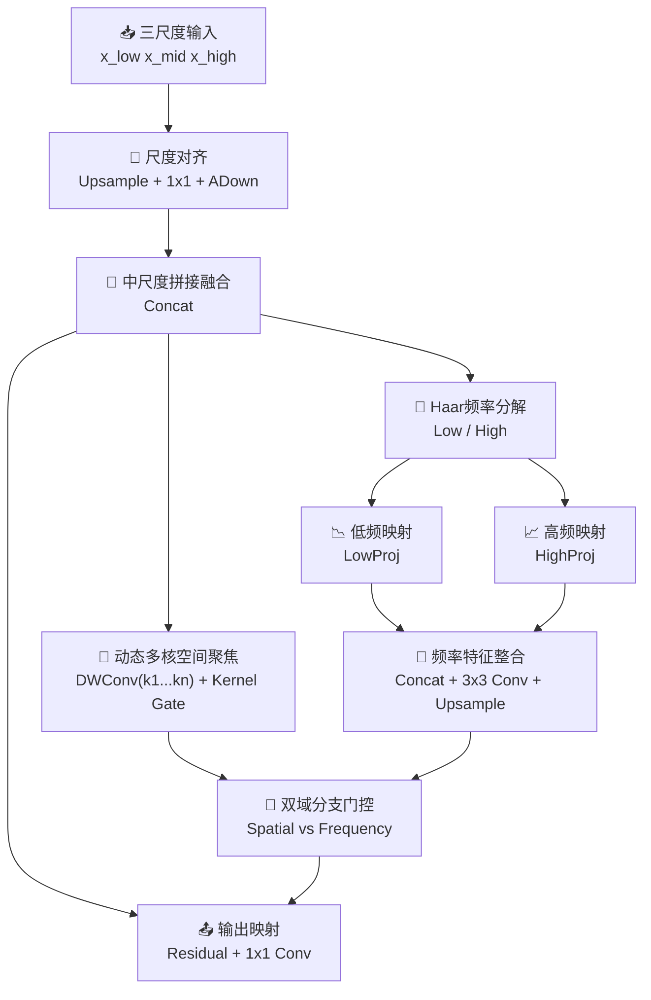

# DynamicFrequencyFocusFeature模块总结

## 1. 动机

### 现有 FocusFeature 的局限
原始 `FocusFeature` 已经能够把三尺度特征统一到中间尺度后再做多核空间聚焦，但它仍然存在两个比较明显的限制：

- **多感受野响应是静态求和的**：不同卷积核分支默认具有近似同等重要性，缺少针对输入内容的动态选择能力。
- **聚焦过程主要发生在空间域**：模块可以扩大感受野，但对低频主体结构与高频细节纹理没有显式区分。
- **多尺度融合后的细节保留依赖卷积隐式学习**：对于小目标、边界和细粒度纹理，单纯依赖空间卷积往往不够直接。
- **空间与频率信息没有协同机制**：即便某些区域更需要高频细节补偿，原始模块也无法显式调整这两类信息的权重关系。

### 提出模块的目的
`DynamicFrequencyFocusFeature` 的目标，是在保留 `FocusFeature` 三尺度聚焦框架的基础上，引入两种新的能力：

- **动态感受野选择能力**：不再把多核深度卷积分支直接相加，而是根据输入内容动态决定不同感受野的贡献大小。
- **空间-频率双路径协同能力**：除了空间域聚焦，再增加一个轻量频域分支，让模块同时利用低频结构和高频细节信息。

因此，这个模块的核心目标可以概括为：

- 保留中尺度聚焦的主框架；
- 将静态多核聚焦升级为动态多核聚焦；
- 引入 Haar 风格频率分解增强细节建模；
- 用门控机制实现空间域与频率域的内容自适应协同。

---

## 2. 模块工作原理和核心思想

### 核心思想
`DynamicFrequencyFocusFeature` 可以概括为四个关键词：**对齐、动态聚焦、频率分解、双域协同**。

- **对齐（Alignment）**：先把三尺度输入统一到中间尺度和同一通道维度。
- **动态聚焦（Dynamic Focus）**：在空间域中使用多核深度卷积分支提取不同感受野信息，并通过门控网络动态分配各分支权重。
- **频率分解（Frequency Decomposition）**：对融合后的特征做 Haar 风格分解，显式分出低频结构和高频细节。
- **双域协同（Dual-domain Fusion）**：通过空间-频率双分支门控，将两类信息按内容自适应方式组合起来。

### 整体流程



对应的主流程可以写成：

```text
[x_low', x_mid', x_high'] = AlignToMid(x_low, x_mid, x_high)
F = Concat(x_low', x_mid', x_high')

F_spatial = DynamicMultiKernelFocus(F)
[F_low, F_high] = HaarDecompose(F)
F_freq = Up(Conv(Concat(LowProj(F_low), HighProj(F_high))))

[w_s, w_f] = Softmax(BranchGate(F_spatial, F_freq))
Y = F + alpha * w_s * F_spatial + beta * w_f * F_freq
Out = Conv1x1(Y)
```

其中：

- `DynamicMultiKernelFocus` 对应动态感受野空间聚焦；
- `HaarDecompose` 对应频率分解；
- `BranchGate` 对应空间域与频率域的双分支权重生成；
- `alpha` 和 `beta` 对应实现中的 `spatial_scale` 与 `frequency_scale`。

### 2.1 三尺度对齐与中尺度聚焦骨架
模块首先沿用 `FocusFeature` 的三尺度融合思路：

- 低分辨率分支通过 `Upsample + 1×1 Conv` 对齐到中尺度；
- 中尺度分支通过 `1×1 Conv` 统一通道；
- 高分辨率分支通过 `ADown` 下采样到中尺度。

最终三路特征在中间尺度上进行拼接：

```text
F = Concat(x_low', x_mid', x_high')
```

这样做的意义在于：

- 维持原始 neck 中“以中尺度为焦点”的结构优势；
- 保证后续空间域与频率域建模都基于统一的空间分辨率；
- 让新模块可以较低成本替换原始 `FocusFeature`。

### 2.2 动态多感受野空间聚焦
原始 `FocusFeature` 中，不同核尺寸的深度卷积分支是直接求和的。`DynamicFrequencyFocusFeature` 则把这一部分改为：

- 保留多组深度卷积，用于抽取多感受野上下文；
- 引入基于全局池化的轻量门控网络；
- 通过 softmax 为“原始分支 + 多个卷积分支”生成动态权重；
- 对所有分支进行加权求和，而不是静态累加。

即：

```text
Branches = [F, DWConv_k1(F), ..., DWConv_kn(F)]
Weights = Softmax(KernelGate(F))
F_spatial = PWConv(Sum(Weights * Branches))
```

这样做的意义是：

- 小目标区域可以更偏向小感受野分支；
- 语义主体区域可以更偏向大感受野分支；
- 模块不再为所有样本使用同一种固定感受野组合。

### 2.3 Haar 风格频率分解
在空间域主干之外，模块还会对拼接后的融合特征执行 Haar 风格频率分解：

```text
[F_low, F_high] = Haar(F)
```

其中：

- `F_low` 表示低频部分，更偏向整体结构与稳定语义；
- `F_high` 表示高频聚合响应，更偏向边界、纹理和局部细节。

与仅依赖空间域卷积相比，这样的好处是：

- 低频与高频信息被显式拆开；
- 模块不需要复杂频域网络也能获得结构先验；
- 对小目标和细节恢复的论文表述更直接。

### 2.4 频率分支建模与上采样回注
频率分支中，低频和高频特征先分别经过 `1×1 Conv` 做轻量映射，再拼接后用 `3×3 Conv` 整合：

```text
F_freq = Conv3x3(Concat(LowProj(F_low), HighProj(F_high)))
F_freq = UpSample(F_freq)
```

这样设计的作用是：

- 在低频中保留主体结构信息；
- 在高频中保留边缘和纹理响应；
- 将频率引导重新恢复到与空间聚焦相同的中尺度尺寸上。

### 2.5 空间域与频率域的双分支门控
最终，模块不会简单把 `F_spatial` 与 `F_freq` 相加，而是先把两路特征送入门控网络生成两个分支系数：

```text
[w_s, w_f] = Softmax(BranchGate(F_spatial, F_freq))
```

然后进行内容感知的双域融合：

```text
Y = F + alpha * w_s * F_spatial + beta * w_f * F_freq
```

这意味着：

- 当输入区域更依赖上下文时，空间域分支会占更大权重；
- 当输入区域更依赖边界和纹理时，频率域分支会得到更高关注；
- 残差主干 `F` 保证了模块的稳定性和可训练性。

---

## 3. 解决了什么问题

### 3.1 解决原始 FocusFeature 多核分支静态求和的问题
原始 `FocusFeature` 默认各个核尺寸分支贡献近似固定，无法根据当前图像内容动态调整感受野组合。

`DynamicFrequencyFocusFeature` 通过动态门控，让不同核分支的权重由输入内容决定，从而提升模块对不同目标尺寸和不同场景复杂度的适应能力。

### 3.2 解决单纯空间域聚焦难以显式建模频率细节的问题
空间卷积虽然能学习上下文，但对低频主体结构与高频边界细节的区分通常是隐式的。

该模块通过 Haar 风格分解把这两类信息显式分离，使频率信息不再只是附带结果，而成为融合决策的一部分。

### 3.3 解决多尺度融合后小目标和边缘细节容易被稀释的问题
三尺度拼接后的特征虽然信息丰富，但如果后续只做空间聚焦，细节响应仍然可能被较强语义分量掩盖。

频率分支的引入，可以为小目标边缘、局部纹理和高频结构提供补充信息，从而增强多尺度融合后的细粒度表达能力。

### 3.4 解决空间域与频率域之间缺少主次调控的问题
即使同时提取了空间域与频率域信息，如果没有显式门控，两者之间也可能互相干扰。

该模块通过双分支门控和可学习缩放系数，使空间主干与频率引导之间形成可调节的协同关系，而不是固定融合比例。

### 3.5 在保持可插拔性的同时提升论文表达力
`DynamicFrequencyFocusFeature` 仍然保持了与原始 `FocusFeature` 相同的输入输出契约，便于直接插入现有 neck。

但在机制上，它已经从“静态多核空间聚焦”升级为“动态感受野 + 频率引导”的双域聚焦模块，更适合用于论文中的创新模块叙事与消融分析。

---

## 4. 总结

`DynamicFrequencyFocusFeature` 本质上是一种把**动态感受野选择**与**空间-频率双路径聚焦**结合起来的中尺度多尺度融合模块。它并不是简单在 `FocusFeature` 后面附加一个频域分支，而是通过：

- **三尺度对齐与中尺度聚焦骨架** 保留原始 FDPN 的结构优势；
- **动态多核空间聚焦** 提升感受野选择的自适应能力；
- **Haar 风格低频-高频分解** 显式区分结构与细节；
- **频率分支建模与回注** 补充细粒度信息；
- **空间-频率双分支门控** 构建内容感知的双域协同关系；

将原始 `FocusFeature` 从“静态空间域多核聚焦”升级为“**动态感受野驱动的双域聚焦模块**”。

因此，`DynamicFrequencyFocusFeature` 特别适合那些既希望增强多尺度语义建模，又希望显式保留边界、纹理和小目标细节响应的检测与分割场景。
