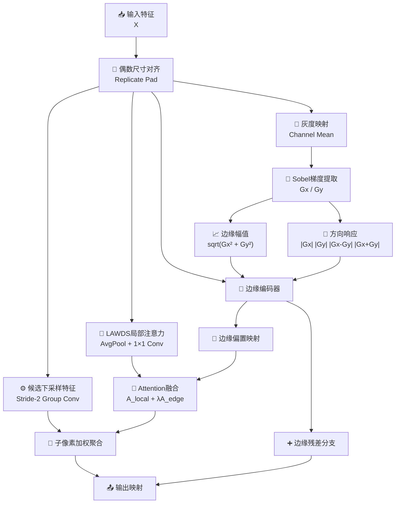

# EdgeLAWDS模块总结

## 1. 动机

### 现有下采样模块对边缘和方向结构保护不足
在目标检测、实例分割和医学影像等任务中，下采样阶段往往是最容易丢失边界细节和方向结构的地方。常见问题主要体现在以下几个方面：

- **池化容易模糊边缘**：平均池化或最大池化虽然简单高效，但对目标边界、细长结构和小目标轮廓的保留能力有限。
- **普通步长卷积对方向信息不敏感**：它能够学习局部模式，但并不会显式区分水平、垂直或对角方向的结构差异。
- **原始 LAWDS 缺少显式边界先验**：虽然 `LAWDS` 已经能在 `2×2` 局部范围内做自适应竞争，但它本质上依旧主要依赖内容响应，而没有明确回答“当前区域是不是边界”“边界朝哪个方向延展”。
- **下采样对小目标和细薄结构尤为敏感**：这类目标一旦在早期下采样阶段被边缘模糊或方向错选，后续层往往很难再恢复。

### 提出模块的目的
EdgeLAWDS（Edge-aware Light Adaptive-weight Downsampling）的目标，是在保留 `LAWDS` 轻量局部竞争机制的前提下，引入一种**显式边缘与方向先验**，使下采样决策不仅依赖局部响应强弱，还能感知当前区域的结构边界和方向属性。

它希望做到：

- 在局部 `2×2` 子像素竞争中继续保持内容感知能力；
- 显式提取梯度强度与方向信息；
- 让边缘结构直接参与注意力权重生成；
- 再通过边缘残差分支补偿主路径中可能遗漏的边界细节。

因此，EdgeLAWDS的核心目标是：

- 把“边界保护”从隐式学习升级为显式机制；
- 在轻量条件下增强方向敏感性；
- 提高下采样阶段对小目标和边缘结构的保真能力。

---

## 2. 模块工作原理和核心思想

### 核心思想
EdgeLAWDS可以概括为四个关键词：**局部选择、边缘感知、方向偏置、残差保留**。

- **局部选择（Local Selection）**：保留 `LAWDS` 的 `2×2` 子像素竞争骨架。
- **边缘感知（Edge Awareness）**：利用固定 Sobel 梯度显式提取边缘强度。
- **方向偏置（Orientation Bias）**：构造多种方向响应描述子，让局部权重具备方向敏感性。
- **残差保留（Residual Preservation）**：增加边缘残差路径，避免结构信息在主路径中被过度压制。

### 整体流程



对应的核心流程可以写成：

```text
X_pad = PadEven(X)

A_local = LocalAttention(X_pad)
S = LocalCandidates(X_pad)

Gray = Mean(X_pad)
Gx, Gy = Sobel(Gray)
M = Magnitude(Gx, Gy)
O = Concat(|Gx|, |Gy|, |Gx-Gy|, |Gx+Gy|)

E = EdgeEncoder(X_pad, M, O)
A_edge = EdgeBias(E)

A = Softmax(A_local + λ * A_edge)
Y = Sum(S * A)
R = EdgeResidual(E)

Out = OutputProj(Y + β * R)
```

其中：

- `A_local` 表示原始 `LAWDS` 风格的局部竞争权重；
- `M` 表示边缘幅值；
- `O` 表示多方向结构描述子；
- `A_edge` 表示由边缘先验生成的局部偏置；
- `R` 表示边缘残差补偿；
- `λ` 与 `β` 分别对应代码中的 `edge_scale` 与 `residual_scale`。

### 2.1 保留 `LAWDS` 的局部竞争主路径
EdgeLAWDS首先保留原始 `LAWDS` 的核心优势：

- 用局部注意力生成四个子像素候选的权重 logits；
- 用 stride-2 分组卷积生成四组局部候选特征；
- 再通过 softmax 完成 `2×2` 子像素竞争。

这保证模块在结构上仍然是一个轻量、可插拔的自适应下采样器，而不是把边缘建模做成一个沉重的外部附加模块。

### 2.2 Sobel 梯度与边缘强度提取
为了让模块显式感知边界，EdgeLAWDS先将输入按通道求均值得到灰度特征，再用固定 Sobel 算子提取水平和垂直梯度：

```text
Gray = Mean(X)
Gx = Sobel_x(Gray)
Gy = Sobel_y(Gray)
M = sqrt(Gx^2 + Gy^2)
```

其中：

- `Gx` 更敏感于垂直边缘；
- `Gy` 更敏感于水平边缘；
- `M` 用来描述当前区域边缘响应的整体强弱。

与完全依赖可学习卷积不同，这种固定梯度提取方式具有很强的解释性，也能在训练初期为模块提供稳定结构先验。

### 2.3 多方向结构描述子
仅有边缘强度还不够，因为不同方向的结构在下采样时面临的问题不同。EdgeLAWDS进一步构造：

```text
O = [|Gx|, |Gy|, |Gx - Gy|, |Gx + Gy|]
```

这四类响应分别可以近似表示：

- 水平方向结构显著性；
- 垂直方向结构显著性；
- 一类对角方向结构；
- 另一类对角方向结构。

这样做的意义在于：模块不再只知道“这里是不是边缘”，还知道“这里更像哪种方向的边缘”。这对于保留细长结构、对角轮廓和复杂边界非常关键。

### 2.4 边缘偏置引导的局部权重生成
在得到原始输入、边缘幅值和方向描述子后，EdgeLAWDS将它们共同送入边缘编码器：

```text
E = EdgeEncoder(Concat(X, M, O))
A_edge = EdgeBias(E)
```

随后把边缘偏置加入原始局部权重：

```text
A = Softmax(A_local + λ * A_edge)
```

这一步意味着 `LAWDS` 原本只基于内容激活的局部竞争，现在会同时受到边缘和方向信息的调制。直观来说：

- 如果某个子像素更符合边界延展方向，它更容易被保留；
- 如果某个区域边缘强而清晰，模块会更谨慎地做局部压缩；
- 如果某个位置缺少明显边界结构，模块则更多退回到原始 `LAWDS` 风格的内容感知选择。

### 2.5 边缘残差补偿路径
主路径的局部竞争虽然已经加入边缘偏置，但仍然可能在强竞争下压制某些弱却有价值的边缘响应。因此，EdgeLAWDS额外保留了一条边缘残差路径：

```text
R = EdgeResidual(AvgPool(E))
Out = OutputProj(Y + β * R)
```

它的作用包括：

- 把边缘编码器中提炼到的结构响应补充回输出；
- 降低主路径竞争带来的细节丢失风险；
- 让模块在强调主导响应的同时，仍保留一定边界冗余信息。

### 2.6 偶数尺寸对齐与安全分组
EdgeLAWDS还做了两项重要工程处理：

- **偶数尺寸对齐**：先对奇数高宽做 `replicate pad`，保证 `2×2` 重排始终合法，输出尺寸稳定为 `ceil(H/2) × ceil(W/2)`；
- **安全分组选择**：内部用安全分组策略计算分组数，避免某些通道配置下分组卷积不整除导致构造失败。

这两点都提升了模块在真实网络中的可插拔性与鲁棒性。

---

## 3. 解决了什么问题

### 3.1 解决普通下采样对边界模糊的问题
无论是平均池化还是普通步长卷积，下采样后最先受损的通常就是目标边界和轮廓细节。

EdgeLAWDS通过显式边缘幅值和方向先验，使权重生成过程更加重视结构边界，从而提升边界保真能力。

### 3.2 解决原始 LAWDS 缺少方向敏感性的问题
原始 `LAWDS` 已经能在局部子像素之间做竞争，但它没有显式区分：

- 水平边缘、
- 垂直边缘、
- 对角边缘。

EdgeLAWDS通过多方向结构描述子，把“方向感知”直接写入局部决策过程，使下采样不仅看响应强弱，也看结构方向。

### 3.3 解决小目标和细长结构在早期下采样中易丢失的问题
小目标边界、血管样结构、裂纹、细线条、遥感道路等目标，本来就高度依赖局部边缘和方向一致性。一旦在早期下采样中发生错误压缩，后续层很难再恢复。

EdgeLAWDS通过边缘偏置与边缘残差双路径保护，使这类结构在下采样后更容易保留下来。

### 3.4 解决纯边缘增强方法与轻量部署之间的矛盾
很多边缘增强模块要么计算较重，要么需要额外复杂分支。EdgeLAWDS只引入：

- 固定 Sobel 梯度；
- 轻量边缘编码器；
- 一条小型残差补偿路径。

因此它在保持轻量性的同时，仍然能够显著增强边界感知能力。

### 3.5 解决复杂通道配置下的模块鲁棒性问题
下采样模块在工程中常常会面对不同通道数配置。如果分组策略不稳健，就可能在某些通道数下直接构造失败。

EdgeLAWDS通过安全分组策略保证分组卷积在更广泛通道配置下都能合法工作，提高了模块的工程鲁棒性。

---

## 4. 总结

EdgeLAWDS本质上是一种将**轻量局部自适应下采样**与**显式边缘方向先验**结合起来的结构感知模块。它通过：

- **保留 LAWDS 的 `2×2` 局部竞争骨架**；
- **使用 Sobel 梯度显式提取边缘强度**；
- **构造多方向描述子增强方向敏感性**；
- **用边缘偏置引导局部权重生成**；
- **用边缘残差补偿保护弱但重要的边界响应**；
- **同时支持奇数尺寸输入和安全通道分组**；

将下采样从“单纯局部内容选择”升级为“**边缘与方向先验引导下的局部竞争式下采样**”。

因此，EdgeLAWDS特别适合那些对边界、小目标、细长结构和方向信息敏感的视觉任务场景。
