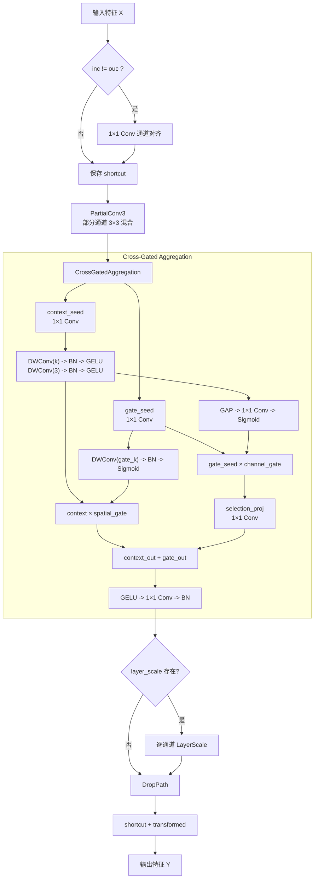

# Faster_CGA_Block模块总结

## 1. 动机

### 原始 `Faster_Block` 在高效建模中的潜在不足
`Faster_Block` 的核心优势在于：用 `PartialConv3` 只对部分通道做 `3×3` 空间混合，再用轻量 `MLP` 完成通道变换，整体计算开销小、部署友好。但如果把它直接用于更复杂的检测和分割场景，仍然存在几个可以继续增强的点：

- **部分空间混合之后的特征交互仍然偏弱**：原始结构在 `PartialConv3` 之后主要依赖点式 `MLP` 做变换，对局部上下文的进一步组织不够充分。
- **缺少显式的上下文分支与门控分支解耦**：模块虽然有残差，但并没有明确区分“负责提取局部上下文”的路径和“负责选择有效响应”的路径。
- **缺少空间门控与通道门控的协同机制**：很多轻量块只做单一维度的权重调制，而没有同时考虑空间位置与通道重要性。
- **局部结构与特征选择之间缺少交叉耦合**：如果上下文提取和权重生成完全独立，模型往往难以学到“什么结构该被强调、什么响应该被抑制”的显式对应关系。

### 提出模块的目的
`Faster_CGA_Block` 的目标，是在保留 `Faster_Block` “**局部高效、接口简洁、残差友好**”这些优点的前提下，把后半段变成一种**交叉门控聚合（Cross-Gated Aggregation）**结构，让模块在较小额外开销下具备更强的上下文建模与自适应选择能力。

它希望做到：

- 保留 `PartialConv3` 的轻量部分空间混合骨架；
- 显式拆分出上下文分支与门控分支；
- 同时引入空间门控和通道门控；
- 让上下文信息反过来指导门控生成，形成交叉耦合；
- 继续保持 `DropPath`、`LayerScale` 和残差连接等现代训练友好设计。

因此，`Faster_CGA_Block` 的核心目标可以概括为：

- 保留 `Faster_Block` 的轻量特征；
- 增强局部上下文表达；
- 提升空间与通道联合选择能力；
- 用更强的结构交互替代简单 `MLP` 尾部。

---

## 2. 模块工作原理和核心思想

### 核心思想
`Faster_CGA_Block` 可以概括为五个关键词：**通道对齐、部分混合、上下文提取、交叉门控、残差融合**。

- **通道对齐（Channel Alignment）**：当输入输出通道不一致时，先用 `1×1 Conv` 对齐通道维度。
- **部分混合（Partial Mixing）**：保留 `Faster_Block` 的 `PartialConv3`，只对一部分通道执行 `3×3` 卷积。
- **上下文提取（Context Extraction）**：用双层深度卷积分支增强局部结构上下文。
- **交叉门控（Cross Gating）**：用空间门控与通道门控共同调制上下文与选择分支。
- **残差融合（Residual Fusion）**：通过 `LayerScale + DropPath + shortcut` 稳定训练并保留原始信息。

### 整体流程



对应的核心流程可以写成：

```text
if inc != ouc:
    X = Conv1x1(X)

S = PartialConv3(X)

ContextSeed = Conv1x1(S)
GateSeed = Conv1x1(S)

Context = DWConv_k(ContextSeed) -> BN -> GELU -> DWConv_3 -> BN -> GELU
SpatialGate = Sigmoid(BN(DWConv_gate(GateSeed)))
ChannelGate = Sigmoid(Conv1x1(GAP(Context)))

ContextOut = Context * SpatialGate
GateOut = selection_proj(GateSeed * ChannelGate)

Z = BN(Conv1x1(GELU(ContextOut + GateOut)))

if layer_scale exists:
    Z = layer_scale * Z

Y = Shortcut + DropPath(Z)
```

其中：

- `PartialConv3` 负责保留 `Faster_Block` 风格的轻量空间建模；
- `Context` 负责提取更强的局部上下文；
- `SpatialGate` 负责抑制或强调特定空间位置；
- `ChannelGate` 负责根据上下文生成通道级重要性；
- `GateOut` 与 `ContextOut` 通过交叉耦合后再统一投影。

### 2.1 通道对齐与残差准备
模块首先判断 `inc` 与 `ouc` 是否一致。如果不一致，就先用 `1×1 Conv` 做通道映射：

```text
X' = Conv1x1(X)
```

这一步的意义是：

- 保证后续 `PartialConv3` 与交叉门控聚合都在统一通道维度上运行；
- 使模块能够像普通残差块一样灵活插入不同层级；
- 让 shortcut 分支与主分支天然具备可相加性。

### 2.2 保留 `Faster_Block` 的部分空间混合骨架
`Faster_CGA_Block` 并没有抛弃 `Faster_Block` 的本体思想，而是完整保留了 `PartialConv3` 这一轻量核心：

```text
S = PartialConv3(X')
```

它只对一部分通道施加 `3×3` 卷积，剩余通道直接保留，然后再在通道维重新拼接。这种设计的优点包括：

- 在不显著增加 FLOPs 的情况下引入局部空间先验；
- 保持一部分原始特征不被过度扰动；
- 为后续更复杂的交叉门控聚合提供一个已经完成初步空间混合的输入。

### 2.3 上下文分支：负责提取局部结构信息
在进入 `CrossGatedAggregation` 后，模块首先从同一个输入 `S` 中构造两组种子特征：

```text
ContextSeed = Conv1x1(S)
GateSeed = Conv1x1(S)
```

其中 `ContextSeed` 进入上下文分支，通过两层深度卷积完成更强的局部建模：

```text
Context = DWConv_k(ContextSeed) -> BN -> GELU
        -> DWConv_3(Context) -> BN -> GELU
```

这条分支的作用是：

- 在保持轻量的前提下扩大局部感受野；
- 用较大的 `context_kernel` 建模更宽的局部结构；
- 再用一个 `3×3` 深度卷积补充更细粒度的局部连续性。

因此，这条路径可以看作是原始 `Faster_Block` 中简单 `MLP` 之后的一次“局部上下文强化”。

### 2.4 空间门控：决定哪些位置应该被强调
`GateSeed` 会进入一个轻量空间门控分支：

```text
SpatialGate = Sigmoid(BN(DWConv_gate(GateSeed)))
```

这里的门控是逐位置、逐通道的，其意义在于：

- 让模型知道当前哪些局部位置更值得保留；
- 对噪声区域或弱响应区域形成抑制；
- 让上下文提取结果不再被无差别传播。

随后，上下文特征会被空间门控调制：

```text
ContextOut = Context * SpatialGate
```

这一步相当于告诉模块：不是所有被提取出来的上下文都重要，只有那些在门控图上被激活的位置才应被突出。

### 2.5 通道门控：让上下文反过来指导选择分支
与空间门控并行，模块还会从 `Context` 中提取全局通道统计：

```text
ChannelGate = Sigmoid(Conv1x1(GAP(Context)))
```

然后用这个通道门控去调制 `GateSeed`：

```text
GateOut = selection_proj(GateSeed * ChannelGate)
```

这一步很关键，因为它不是简单对 `Context` 自己做 SE 式重标定，而是让**上下文分支的全局信息反过来调制选择分支**。这意味着：

- 如果某些通道在当前上下文中更有判别价值，它们会被显式放大；
- 如果某些通道主要响应噪声或冗余模式，它们会被抑制；
- 特征选择不再只由 `GateSeed` 自己决定，而是受到 `Context` 的全局指导。

这正是“Cross-Gated”名字的来源之一。

### 2.6 交叉融合与输出映射
得到 `ContextOut` 和 `GateOut` 后，模块先做相加融合：

```text
Fuse = ContextOut + GateOut
```

再经过一个轻量输出投影：

```text
Z = GELU(Fuse) -> Conv1x1 -> BN
```

这样设计的含义是：

- `ContextOut` 提供结构上下文增强后的响应；
- `GateOut` 提供经过通道选择的补充响应；
- 两者先融合再投影，可以把空间选择与通道选择统一映射回目标特征空间。

### 2.7 `LayerScale`、`DropPath` 与残差输出
为了保持训练稳定性，模块最后还保留了两个现代残差块常见设计：

- 若设置 `layer_scale_init_value > 0`，则引入逐通道缩放参数：

```text
Z = layer_scale * Z
```

- 随后通过 `DropPath` 做随机深度正则：

```text
Y = Shortcut + DropPath(Z)
```

这让 `Faster_CGA_Block` 在深层堆叠时更稳定，也更容易直接接入现有主干或颈部网络中。

---

## 3. 解决了什么问题

### 3.1 解决原始 `Faster_Block` 后端表达偏线性的问题
原始 `Faster_Block` 在 `PartialConv3` 之后主要依赖点式 `MLP` 完成变换，虽然高效，但对局部上下文的显式建模仍然有限。

`Faster_CGA_Block` 用深度卷积上下文分支替代简单线性尾部，让后续特征提炼更适合结构复杂场景。

### 3.2 解决局部上下文与特征选择解耦不足的问题
很多轻量模块虽然有注意力或门控，但没有明确区分“谁负责提取上下文”和“谁负责做选择”。

`Faster_CGA_Block` 通过 `ContextSeed` 和 `GateSeed` 双种子分支，把上下文建模与权重调制显式拆开，再通过交叉门控重新耦合，使结构更清晰、也更容易解释。

### 3.3 解决只做单一维度门控的问题
只做空间门控时，通道选择往往不足；只做通道门控时，空间位置信息又会被忽略。

该模块同时引入：

- 基于 `GateSeed` 的空间门控；
- 基于 `Context` 的通道门控；

从而让“哪里重要”和“哪些通道重要”被同时建模。

### 3.4 解决上下文信息无法反向指导特征选择的问题
在很多模块中，门控仅仅由待门控特征本身生成，缺少“由上下文反向指导选择”的机制。

`Faster_CGA_Block` 用 `Context -> ChannelGate -> GateSeed` 这一路径建立了显式反馈关系，使上下文真正参与到选择策略中，而不只是作为被处理对象存在。

### 3.5 解决轻量块在复杂场景下表达力不足的问题
对于密集目标、小目标、边界复杂或纹理细碎的场景，仅依靠轻量 `MLP` 尾部容易让模块在效率和表达力之间出现偏科。

`Faster_CGA_Block` 通过较小额外代价引入双深度卷积分支、双门控机制和交叉融合，使模块在保持轻量的同时获得更强的局部判别能力。

---

## 4. 总结

`Faster_CGA_Block` 本质上是一种把 **Faster 风格部分空间混合** 与 **Cross-Gated Aggregation 交叉门控聚合** 结合起来的轻量增强块。它通过：

- **保留 `PartialConv3` 的高效空间混合骨架**；
- **用上下文分支增强局部结构建模**；
- **用空间门控筛选重要位置**；
- **用通道门控让上下文反向指导选择分支**；
- **用轻量输出投影统一融合结果**；
- **保留 `LayerScale`、`DropPath` 与残差连接**；

将原始 `Faster_Block` 从“部分空间混合 + 简单点式变换”升级为“**部分空间混合 + 交叉门控上下文聚合**”。

因此，`Faster_CGA_Block` 特别适合那些既关注轻量部署，又希望提升局部上下文表达、空间选择能力和通道判别性的检测、分割与通用视觉主干场景。
