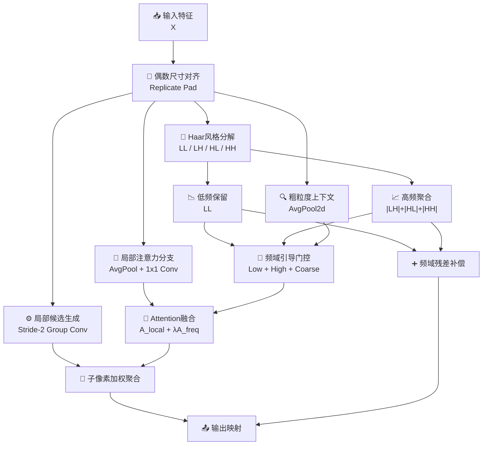

# FreqLAWDS模块总结

## 1. 动机

### 现有轻量下采样方式的问题
在目标检测、语义分割以及轻量视觉骨干网络中，下采样模块不仅承担“降低分辨率”的作用，更直接影响后续层对语义主体、纹理细节和边界结构的保留质量。传统下采样方式虽然实现简单，但往往会带来以下问题：

- **池化类方法过于平均化**：平均池化虽然稳定，但容易把高频细节、边缘和小目标响应一起抹平。
- **步长卷积类方法偏向固定采样模式**：即使感受野更大，其采样策略仍然是固定的，难以根据输入内容动态决定“该保留哪一部分局部信息”。
- **原始 LAWDS 缺少显式频域先验**：`LAWDS` 已经能够在 `2×2` 子像素内做自适应加权选择，但它主要依赖局部空间注意力，本质上仍然缺少对低频语义主体和高频纹理细节的显式区分。
- **纯频域下采样又往往不够自适应**：像固定小波分解这类方法虽然能保留频域信息，但对不同输入内容的动态适配能力偏弱，容易出现“频率保留了，但并不一定保留了当前任务最重要的信息”的问题。

### 提出模块的目的
FreqLAWDS（Frequency-guided Light Adaptive-weight Downsampling）的目标，是在保留 `LAWDS` “**局部自适应子像素竞争**”优势的基础上，引入一种更加轻量、更加工程友好的**频域引导机制**。

它希望同时做到两件事：

- 在局部 `2×2` 区域内继续保持内容感知的动态选择能力；
- 在全局机制上显式区分**低频语义结构**和**高频细节纹理**，让局部选择不再只是“看局部响应大小”，而是“在频域先验约束下选择更合理的子特征”。

因此，FreqLAWDS的核心目标可以概括为：

- 保留 `LAWDS` 的局部自适应性；
- 引入 Haar 风格频率先验；
- 通过低频-高频联合引导增强下采样决策质量；
- 在轻量条件下提升模块的论文表达力和工程实用性。

---

## 2. 模块工作原理和核心思想

### 核心思想
FreqLAWDS可以概括为四个关键词：**局部竞争、频域分解、联合引导、残差补偿**。

- **局部竞争（Local Competition）**：沿用 `LAWDS` 的 `2×2` 子像素 softmax 竞争机制，在局部区域中动态决定四个候选子特征的贡献。
- **频域分解（Frequency Decomposition）**：通过固定 Haar 风格滤波器把输入拆分成低频 `LL` 和聚合高频 `HF`。
- **联合引导（Joint Guidance）**：把低频、 高频以及粗粒度下采样上下文一起送入轻量门控网络，为局部竞争权重提供频域偏置。
- **残差补偿（Residual Compensation）**：用低频和高频共同构造频域残差，避免在主路径选择过程中遗漏有价值的信息。

### 整体流程



对应的核心流程可以写成：

```text
X_pad = PadEven(X)

A_local = LocalAttention(X_pad)
S = LocalCandidates(X_pad)

[LL, HF] = HaarDecompose(X_pad)
C = AvgPool(X_pad)

A_freq = FreqGate(LL, HF, C)
A = Softmax(A_local + λ * A_freq)

Y = Sum(S * A)
R = FreqResidual(LL, HF)

Out = OutputProj(Y + β * R)
```

其中：

- `A_local` 表示原始 `LAWDS` 风格的局部子像素竞争权重；
- `LL` 表示低频结构分量；
- `HF` 表示聚合后的高频细节分量；
- `A_freq` 表示由频域先验产生的权重偏置；
- `R` 表示频域残差补偿项；
- `λ` 与 `β` 分别对应代码中的 `freq_scale` 与 `res_scale`。

### 2.1 局部 `2×2` 自适应子像素竞争
FreqLAWDS首先保留了原始 `LAWDS` 的核心骨架。它先利用：

- `AvgPool2d(3,1,1) + 1×1 Conv` 生成局部权重 logits；
- `stride=2` 的分组卷积生成四组候选下采样特征；
- 再把这四组候选重排为 `2×2` 对应的四个子像素候选。

这意味着在每一个输出位置上，模块不会直接固定取样，而是通过 softmax 在四个局部候选之间做竞争式选择。与普通步长卷积相比，FreqLAWDS并不是“固定往下采样”，而是在问：

> 当前这个局部区域里，哪一个子像素更值得被保留下来？

### 2.2 Haar 风格低频-高频先验分解
仅靠局部注意力仍然不够，因为不同子像素虽然局部响应不同，但这些响应到底来自：

- 低频语义主体，
- 高频纹理边缘，
- 还是噪声型细碎扰动，

原始 `LAWDS` 并不能显式分辨。

为了解决这个问题，FreqLAWDS使用固定 Haar 风格核对输入进行轻量频率分解：

```text
[LL, LH, HL, HH] = Haar(X)
HF = |LH| + |HL| + |HH|
```

其中：

- `LL` 代表低频部分，更偏向主体结构和稳定语义；
- `LH / HL / HH` 代表不同方向的高频细节；
- `HF` 则是把三类高频分量聚合后的统一高频响应。

这样做的意义在于：模块不需要引入复杂频域网络，就能显式获得“主体信息”和“细节信息”的两种先验。

### 2.3 频域引导门控机制
在得到 `LL`、`HF` 和粗粒度平均池化上下文后，FreqLAWDS会先对低频和高频分量做轻量映射，再拼接成频域上下文：

```text
Z_freq = Concat(LowProj(LL), HighProj(HF), Coarse(X))
A_freq = FreqGate(Z_freq)
```

然后将频域权重偏置加到局部注意力 logits 上：

```text
A = Softmax(A_local + λ * A_freq)
```

这一步很关键，因为它把原本只依赖局部空间响应的选择过程，升级成了“**局部响应 + 频域先验**”的联合决策。

直观理解上：

- 如果某个区域低频稳定且主体明显，模块会更倾向保留语义一致性更高的子像素；
- 如果某个区域高频强、边缘清晰，模块会更倾向保留纹理和结构细节更强的子像素；
- 如果某个区域只有碎片化高频噪声而缺少稳定结构，频域门控也可以对局部选择起到一定约束作用。

### 2.4 频域残差补偿机制
除了主路径的频域引导外，FreqLAWDS还额外保留了一条频域残差路径：

```text
R = FreqResidual(Concat(LL, HF))
Out = OutputProj(Y + β * R)
```

其作用包括：

- 从低频信息中恢复稳定结构；
- 从高频信息中补充边缘和纹理响应；
- 防止局部竞争路径过于激进，导致部分有效频率成分被遗漏。

这让模块既有主路径的自适应选择能力，也有残差路径的稳健补偿能力。

### 2.5 对奇数尺寸输入的工程适配
FreqLAWDS内部先对输入做偶数尺寸对齐：

```text
X_pad = PadEven(X)
```

这样做的意义是：

- 保证 `2×2` 子像素重排和 Haar 风格分解始终合法；
- 使模块对奇数高宽输入也能稳定输出 `ceil(H/2) × ceil(W/2)` 尺寸；
- 提高模块在检测和分割真实工程场景中的可插拔性。

---

## 3. 解决了什么问题

### 3.1 解决原始 LAWDS 缺少显式频域建模的问题
原始 `LAWDS` 已经能够在空间局部进行自适应竞争，但它并不知道当前局部响应究竟属于低频主体、边缘纹理还是噪声型高频。

FreqLAWDS通过显式构造 `LL` 和 `HF`，把“频率属性”直接写进权重生成过程，让局部选择具备更强的解释性与结构感知能力。

### 3.2 解决传统池化或步长卷积对细节保护不足的问题
平均池化容易模糊边界，步长卷积则往往使用固定采样模式。它们都很难在不同图像内容下动态平衡：

- 主体语义保留；
- 边缘细节保留；
- 高频噪声抑制。

FreqLAWDS通过频域引导门控，使这一平衡变成内容自适应决策，而不再是固定采样。

### 3.3 解决纯频域方法不够自适应的问题
小波类方法擅长保留频率信息，但常见问题是“频率分开了，却没有真正学会在当前任务里该优先保留什么”。

FreqLAWDS将频域分解与 `LAWDS` 的局部竞争机制结合，使频域先验不再孤立存在，而是直接影响局部候选的选择顺序和权重大小。

### 3.4 解决轻量下采样中语义与细节难以兼顾的问题
在目标检测和分割中，低频信息通常更偏向：

- 语义主体；
- 稳定轮廓；
- 背景-前景整体结构。

而高频信息更偏向：

- 边缘；
- 纹理；
- 小目标细粒度响应。

FreqLAWDS通过低频-高频联合引导和频域残差补偿，使两类信息在轻量条件下能够更合理地协同工作。

### 3.5 解决奇数尺寸输入的部署不稳定问题
很多基于 `2×2` 重排的模块默认假设输入高宽为偶数，在真实网络里并不总是成立。FreqLAWDS内部使用 `replicate pad` 自动补齐，使它在部署和多尺度输入场景下更加稳定。

---

## 4. 总结

FreqLAWDS本质上是一种把**局部自适应下采样**与**显式频域先验**融合起来的轻量模块。它并不是简单把小波分解和 `LAWDS` 拼接在一起，而是通过：

- **局部 `2×2` 子像素竞争** 保留 `LAWDS` 的内容感知选择能力；
- **Haar 风格低频-高频分解** 显式建模语义主体和细节纹理；
- **频域引导门控** 让局部选择具有更强的结构解释性；
- **频域残差补偿** 提升稳健性与信息保留能力；
- **奇数尺寸适配** 增强工程落地性；

将下采样过程从“单纯局部加权”升级为“**频域引导下的局部竞争式下采样**”。

因此，FreqLAWDS特别适合那些既希望保持轻量，又希望在下采样阶段尽量兼顾语义结构与纹理细节的视觉任务场景。
