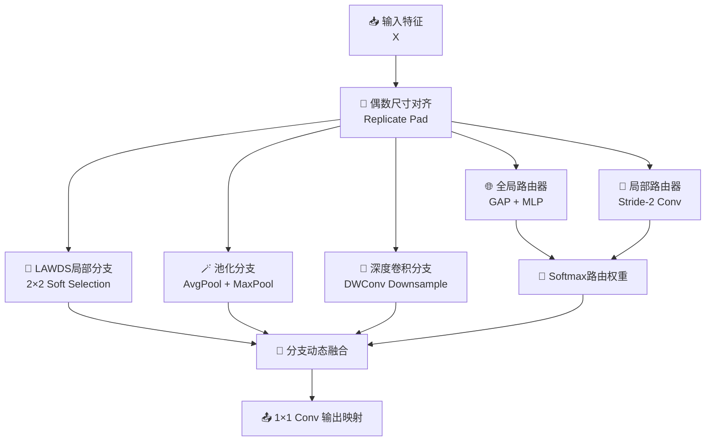

# RouterLAWDS模块总结

## 1. 动机

### 现有下采样方式存在的单一路径偏置
在视觉模型中，不同类型的下采样算子往往具有非常不同的归纳偏置：

- **池化分支** 更稳定，擅长保留整体统计信息，但容易模糊边界和小目标细节；
- **步长卷积分支** 更擅长学习纹理与局部结构，但固定采样模式可能带来别名或内容依赖不足的问题；
- **LAWDS 类局部竞争分支** 能在 `2×2` 子像素中做内容感知选择，但其表达仍然主要局限在单一路径内部。

问题在于，真实图像中的不同区域并不适合用同一种下采样策略统一处理：

- 背景和平滑区域更适合统计稳定的下采样；
- 边缘、纹理和小目标区域更适合细节保留能力强的下采样；
- 某些语义显著区域又更适合动态局部竞争式保留。

如果模块只依赖某一种下采样算子，就容易在不同场景下形成固定偏置。

### 提出模块的目的
RouterLAWDS（Routing-based Light Adaptive-weight Downsampling）的目标，是将“**下采样选择权**”从固定算子本身转移到一个轻量动态路由器手中。

它希望做到：

- 不是只在 `2×2` 子像素内部做竞争；
- 而是让**不同类型的下采样分支**也进入竞争关系；
- 并根据输入内容动态决定当前区域更应该相信哪一种下采样路径。

因此，RouterLAWDS的核心思路可以概括为：

- 建立三条具有不同归纳偏置的下采样分支；
- 通过全局语义与局部证据联合生成动态路由权重；
- 在每个空间位置自适应混合三条分支的输出。

这使下采样过程从“固定算子执行”升级为“**动态路由决策后的分支融合**”。

---

## 2. 模块工作原理和核心思想

### 核心思想
RouterLAWDS可以概括为四个关键词：**分支、竞争、路由、融合**。

- **分支（Branching）**：同时构建三条下采样路径，分别强调局部竞争、统计稳定性与卷积结构建模。
- **竞争（Competition）**：三条分支不是简单并联，而是通过 softmax 路由权重形成显式竞争关系。
- **路由（Routing）**：路由信息由全局上下文和局部下采样证据共同决定。
- **融合（Fusion）**：最终输出不是来自单一分支，而是来自三条分支的内容自适应加权组合。

### 整体流程



对应的核心流程可以写成：

```text
X_pad = PadEven(X)

B1 = LocalLAWDS(X_pad)
B2 = PoolBranch(X_pad)
B3 = DepthwiseBranch(X_pad)

R_global = GlobalRouter(X_pad)
R_local = LocalRouter(X_pad)
R = Softmax(R_global + R_local)

Out = OutputProj(r1 * B1 + r2 * B2 + r3 * B3)
```

其中：

- `B1` 是 `LAWDS` 风格的局部竞争分支；
- `B2` 是平均池化与最大池化联合构成的统计分支；
- `B3` 是深度卷积下采样分支；
- `R_global` 描述输入的全局语义倾向；
- `R_local` 描述局部位置的路由需求；
- `r1, r2, r3` 是三条分支的动态竞争权重。

### 2.1 三条互补下采样分支
RouterLAWDS的核心不是单一算子的增强，而是让不同归纳偏置的下采样路径同时存在。

#### 分支一：LAWDS 局部竞争分支
第一条分支保留 `LAWDS` 的核心思想：

- 利用局部注意力生成 `2×2` 候选权重；
- 对四个子像素候选特征进行 softmax 加权聚合。

这一分支更适合处理：

- 内容差异明显的局部区域；
- 边缘附近的局部选择问题；
- 需要细粒度保留的显著区域。

#### 分支二：池化稳定分支
第二条分支并不依赖复杂动态选择，而是先做：

```text
AvgPool(X), MaxPool(X)
```

再将二者拼接后进行 `1×1` 映射。

这条分支更偏向：

- 稳定语义统计；
- 背景和平滑区域的鲁棒压缩；
- 对局部噪声不过度敏感的响应。

#### 分支三：深度卷积结构分支
第三条分支使用：

- `stride=2` 的深度卷积；
- 再接 `1×1` 通道映射。

这条分支相较于池化更具可学习性，相较于全卷积又更加轻量。它更适合：

- 保留局部纹理模式；
- 利用可学习卷积核对局部结构做适应性建模；
- 在轻量成本下增强表达能力。

### 2.2 全局-局部联合路由机制
如果三条分支只是并联后直接相加，那么 RouterLAWDS 就退化成普通多分支模块，无法体现“路由”这一核心创新点。

因此，该模块专门设计了两个互补的路由器：

#### 全局路由器
全局路由器通过：

```text
GAP -> 1×1 Conv -> ReLU -> 1×1 Conv
```

生成一个全局的三分支偏好。它更像在回答：

> 当前这一张图，整体更适合哪一种下采样风格？

#### 局部路由器
局部路由器通过：

```text
Stride-2 Conv -> 1×1 Conv
```

直接产生空间位置相关的路由 logits。它更像在回答：

> 当前这个位置，应该更相信哪一条分支？

最终路由权重为：

```text
R = Softmax(R_local + R_global)
```

这样设计的好处是：

- 全局路由提供整体场景偏好；
- 局部路由提供逐位置细化决策；
- softmax 使三条分支形成显式竞争，而不是相互独立缩放。

### 2.3 分支动态融合
在得到三条分支输出和路由权重后，模块执行：

```text
Y = r1 * B1 + r2 * B2 + r3 * B3
Out = Conv1x1(Y)
```

这意味着最终输出不是固定来自哪一种算子，而是来自当前输入内容下的最佳组合。

直观上：

- 平滑背景区域可能更偏向池化分支；
- 边缘和小目标区域可能更偏向 LAWDS 局部分支；
- 纹理或结构更复杂的区域可能更偏向深度卷积分支。

因此，RouterLAWDS并不是“把三种方法堆在一起”，而是让它们在同一个下采样位置上完成“内容驱动的算子选择”。

### 2.4 奇数尺寸输入适配
为了兼容真实网络中的多尺度输入，RouterLAWDS在内部对奇数高宽输入做 `replicate pad` 补齐。这样可以保证：

- 三条分支始终在一致空间尺度上工作；
- 输出尺寸稳定为 `ceil(H/2) × ceil(W/2)`；
- 模块在检测和分割网络中更易直接插入。

---

## 3. 解决了什么问题

### 3.1 解决单一下采样算子归纳偏置固定的问题
传统模块一旦选定池化、步长卷积或局部竞争方式，后续对所有样本和所有位置基本都使用相同的规则。

RouterLAWDS通过三分支竞争，把“选择哪一种下采样行为”的权力动态化，从而显著减轻固定算子偏置。

### 3.2 解决不同区域对下采样策略需求不同的问题
真实图像中的背景、目标主体、边缘、纹理和噪声区域，本来就不应该共享完全相同的下采样策略。

RouterLAWDS利用局部路由权重，让不同空间位置可以偏向不同分支，从而使下采样策略更加细粒度和内容感知。

### 3.3 解决单一局部竞争机制表达维度不足的问题
原始 `LAWDS` 强在局部 `2×2` 子像素竞争，但其竞争对象始终局限于四个子像素候选。

RouterLAWDS进一步把竞争提升到“**不同下采样算子之间**”，使模块不仅能决定“取哪个子像素”，还能决定“该采用哪种算子风格”。

### 3.4 解决多分支模块缺少明确决策逻辑的问题
很多多分支模块只是把多个分支输出相加或拼接，本质上仍然缺少显式决策机制。

RouterLAWDS通过全局-局部联合路由和 softmax 分支竞争，使三条分支的主次关系在每个位置都明确可解释。

### 3.5 在轻量条件下提升自适应性与工程可插拔性
RouterLAWDS虽然增加了三条分支和路由器，但各分支本身都较轻量：

- LAWDS局部分支主要是轻量局部加权；
- 池化分支计算便宜；
- 深度卷积分支采用轻量 DWConv；
- 路由器也仅由少量 `1×1` 和 `3×3` 卷积构成。

因此，它在保持工程可用性的同时，为下采样阶段带来了更强的动态性和论文表达力。

---

## 4. 总结

RouterLAWDS本质上是一种**面向下采样阶段的动态算子路由模块**。它的核心并不是再设计一种新的固定下采样核，而是通过：

- **LAWDS局部竞争分支** 提供细粒度内容感知选择；
- **池化分支** 提供稳定统计压缩；
- **深度卷积分支** 提供可学习局部结构建模；
- **全局-局部联合路由器** 决定不同区域更应该相信哪一种下采样路径；
- **softmax 分支竞争** 让融合过程具备明确决策逻辑；

将下采样从“单一路径执行”升级为“**多路径竞争后的动态路由下采样**”。

因此，RouterLAWDS特别适合那些输入内容差异大、不同区域对下采样行为需求不同、并且希望在轻量结构中引入更强动态决策能力的视觉任务场景。
